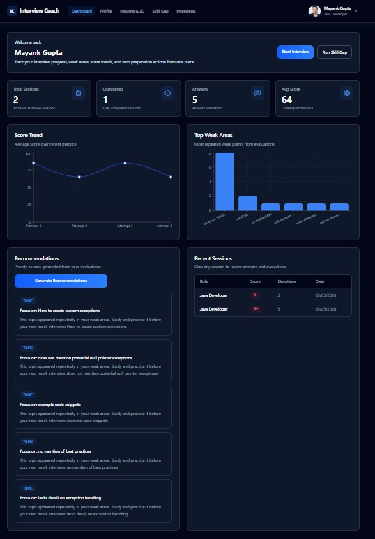
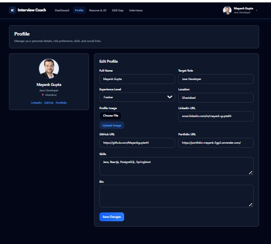
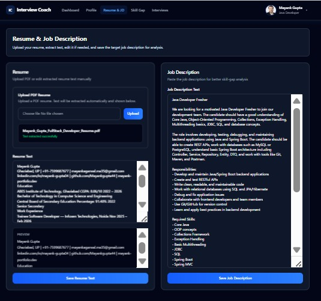
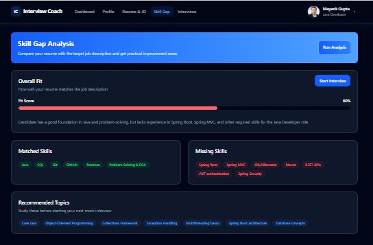
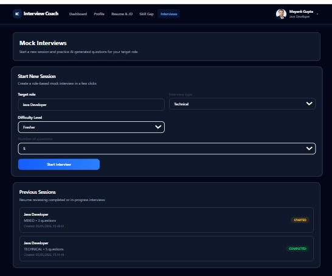
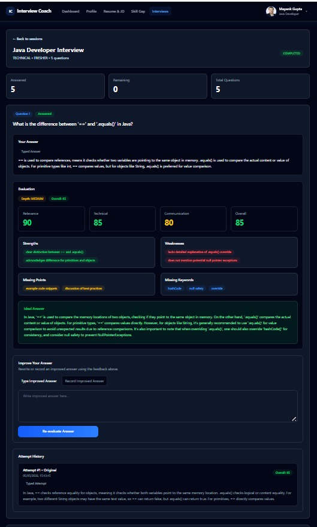
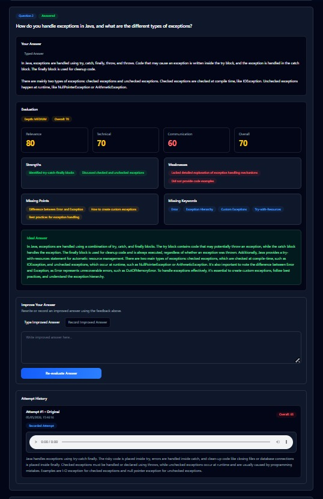
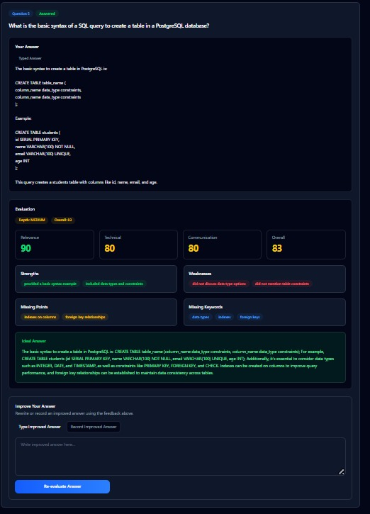

# Interview Coach Frontend

Frontend for an AI-powered Interview Preparation Platform that allows users to practice interviews, submit answers, and get AI-based feedback.

---

## 🚀 Features

- 🎯 Select topic and difficulty level  
- 🤖 AI-generated interview questions  
- 📝 Answer submission interface  
- 📊 Performance tracking dashboard  
- 📈 AI-based feedback and insights  

---

## 🛠️ Tech Stack

- React (Vite)  
- Tailwind CSS  
- JavaScript  

---

## ⚙️ Setup & Run

1. Clone the repository

```bash
git clone https://github.com/Mayankgupta44/interview-coach-frontend.git
````

2. Install dependencies

```bash
npm install
```

3. Start the development server

```bash
npm run dev
```

---

## 🔗 Backend Repository

[https://github.com/Mayankgupta44/interview-coach-backend](https://github.com/Mayankgupta44/interview-coach-backend)

---

## 🔄 Workflow

1. User selects topic and difficulty
2. System generates interview questions using AI
3. User submits answers
4. Backend evaluates responses
5. Frontend displays feedback and insights

---

## 📌 Status

Frontend is under active development. Core UI and main flow are implemented.

---

## Screenshots

### Dashboard


### Profile


### Resume & Job Description


### Skill Gap Analysis


### Mock Interviews


### Interview Result - Question 1


### Interview Result - Question 2


### Interview Result - Question 5

